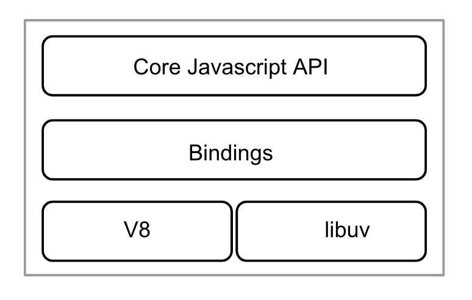

 

 _이 글은 'Node.js 디자인 패턴' 책을 보며 공부한 내용을 정리한 글입니다._   

 

자바스크립트는 싱글 스레드 언어로 알려져있습니다. 하지만 우리는 Network I/O, File system I/O 등의 작업이 비동기적으로 이루어진다는 것을 알고 있습니다. 그렇다면 Node.js는 어떻게 이런 비동기 작업을 처리하는 것인지 Node.js를 구성하고있는 요소부터 시작해서 하나씩 알아보도록 하겠습니다.  

Node.js의 공식홈페이지에서는 Node.js를 다음과 같이 표현하고 있습니다.
  
> Node.js® is a JavaScript runtime built on Chrome's V8 JavaScript engine.  

Node.js를 구성하는 전체 구조를 잘 표현하는 문장은 아니지만 V8엔진을 이용한 자바스크립트 구동환경이라는 것은 알 수 있습니다. 실제로 Node.js는 브라우저에서만 실행할 수 있던 자바스크립트를 브라우저 바깥에서 실행가능하게 만들어주는 자바스크립트 runtime입니다.  

 

## Node.js의 구성요소  

Node.js를 구성하는 요소는 크게 **libuv, V8, Bindings, Core Javascript API**라고 할 수 있습니다. 각 요소의 역할은 다음과 같습니다.  

**V8** : C++로 작성되고 Chrome브라우저에서 사용되는 오픈소스 javascript engine입니다. javascript코드를 기계어로 컴파일하고 실행하는 역할을 합니다. [V8엔진이 javascript코드를 실행하는 방법](https://medium.com/@pks2974/v8-%EC%97%90%EC%84%9C-javascript-%EC%BD%94%EB%93%9C%EB%A5%BC-%EC%8B%A4%ED%96%89%ED%95%98%EB%8A%94-%EB%B0%A9%EB%B2%95-%EC%A0%95%EB%A6%AC%ED%95%B4%EB%B3%B4%EA%B8%B0-25837f61f551)  

**libuv** : Node.js의 핵심인 Event-Driven, Non-blocking IO 방식의 작업을 가능하게 해주는 C 라이브러리입니다. 이벤트 루프를 만들고 이벤트 큐를 관리하며 운영체제 커널의 비동기 인터페이스를 이용하는 등의 기능을 제공합니다. 우리가 작성한 비동기 요청과 콜백들은 이 모듈을 통해 처리되게 됩니다. [libuv 공식문서](https://libuv.org/)  

**Core Javascript API** : Node.js Core 라이브러리의 javascript API 이며 Node.js의 기본 기능을 구현하는 코어 모듈들입니다. 우리가 다른 패키지의 설치 없이 require()로 로드해서 사용하는 모듈들( fs, os, path등... )이 있습니다. [Node.js API](https://nodejs.org/api/)

**Bindings** : C/C++로 이루어져있는 Node.js의 core 라이브러리들( c-ares, zlib, OpenSSL, http-parser등... )을 javascript로 사용가능하게 해줍니다. 코드의 재사용성과 C/C++언어의 성능상의 이점을 얻을 수 있게 됩니다.  

Node.js는 위와같이 이루어진 구성요소 위에 사용자 영역의 모듈과 어플리케이션이 올라와서 실행되는 구조입니다.  
Node.js의 구성요소에 대해 하나씩 공부하는 것만으로도 꽤 많은 시간이 걸릴 것으로 예상됩니다. 다음 게시글에서는 libuv가 어떻게 사용자의 비동기 요청과 이벤트를 처리하는지 알아보도록 하겠습니다.  

 

## References  

 

<https://www.zcfy.cc/original/architecture-of-node-js-internal-codebase-506.html>